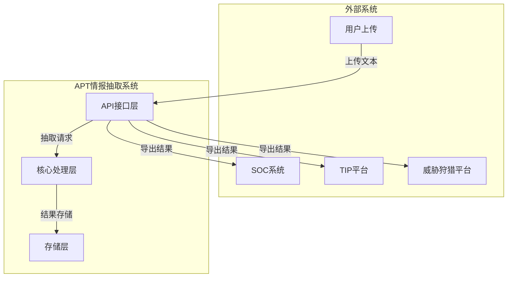
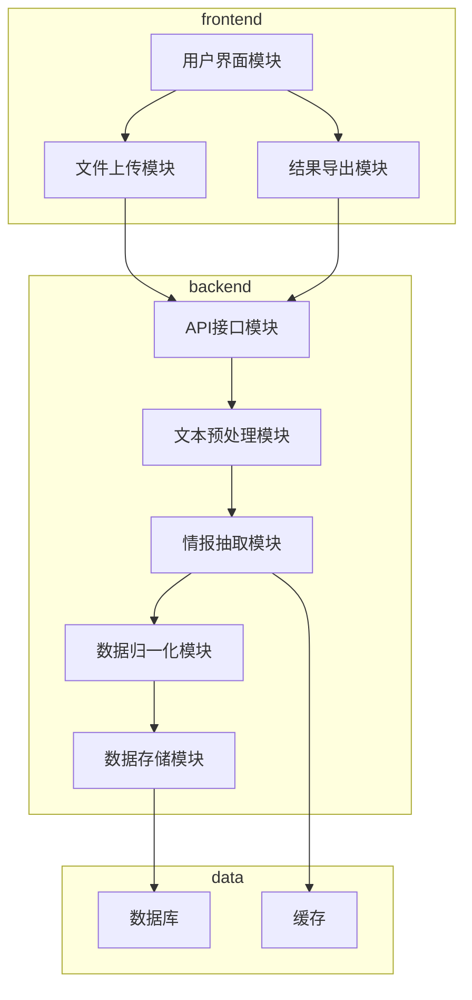
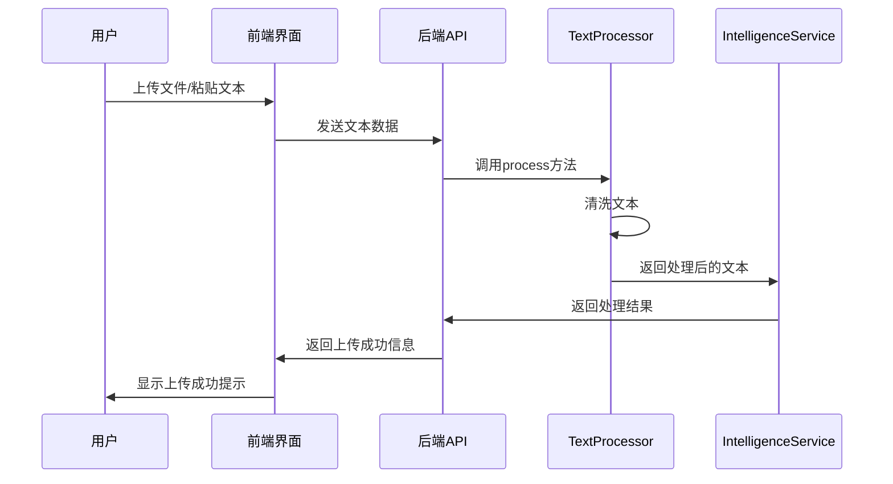
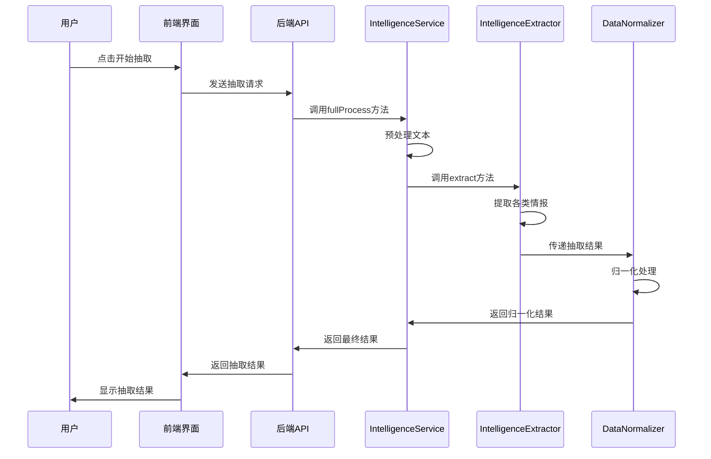
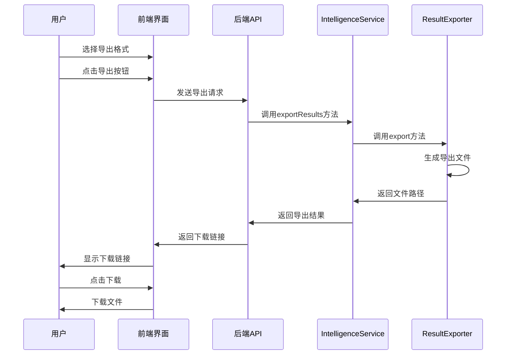
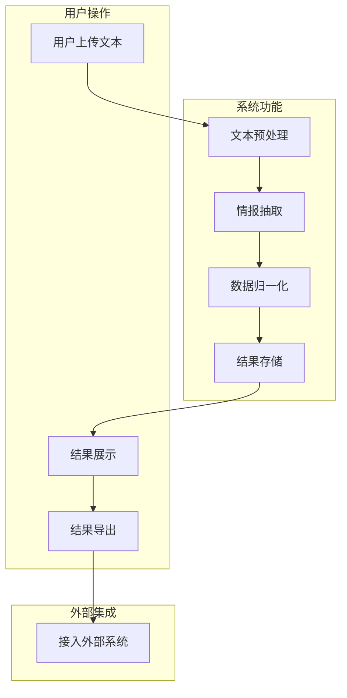
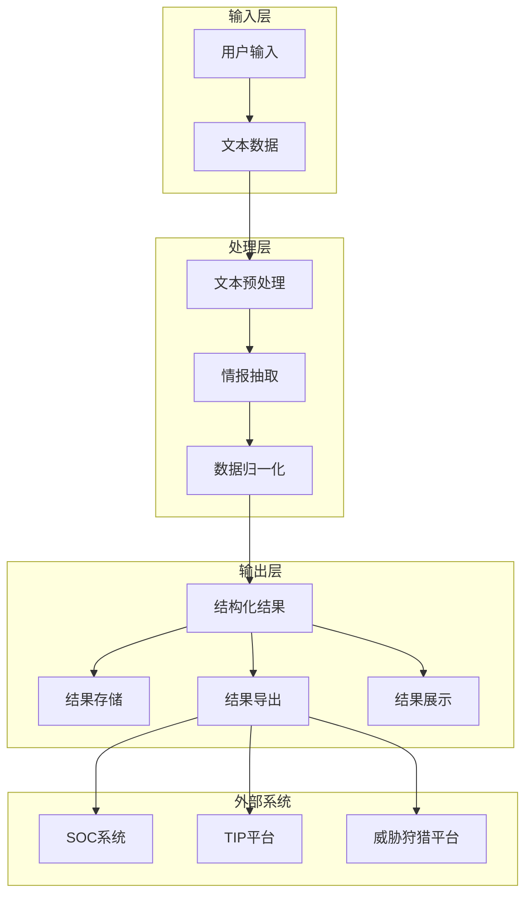
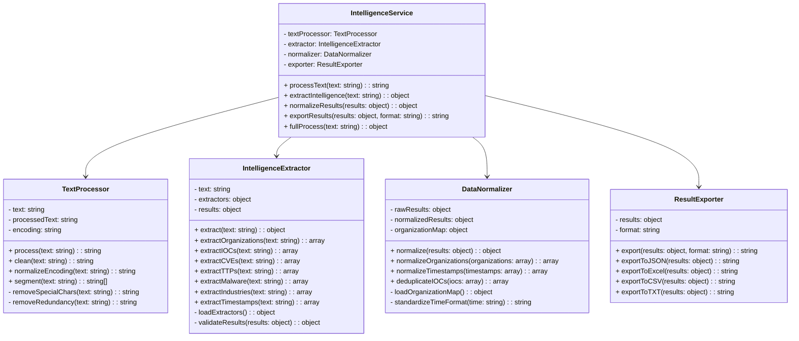

# APT攻击威胁情报智能信息抽取系统设计说明书

## 1 概述

### 1.1 编写目的
本文档的编写目的是：详细定义APT攻击威胁情报智能信息抽取系统的总体功能；给出系统的结构设计和过程设计，作为程序编写的依据。

### 1.2 参考资料
包括：
- 项目来源：网络安全威胁情报分析需求
- 本文档中引用到的规范和资料：
  - MITRE ATT&CK框架：https://attack.mitre.org/
  - CVE漏洞数据库：https://cve.mitre.org/
  - STIX 2.1标准：https://oasis-open.github.io/cti-documentation/stix/intro

### 1.3 术语和缩写词
| 术语/缩写词 | 中文译名 | 英文全称 | 定义 |
|------------|---------|----------|------|
| APT | 高级持续性威胁 | Advanced Persistent Threat | 一种复杂的、有针对性的网络攻击形式，通常由国家支持或有组织的黑客团体发起 |
| IOC | 威胁指标 | Indicators of Compromise | 用于识别网络安全威胁的证据，如IP地址、域名、文件哈希等 |
| TTP | 战术、技术和过程 | Tactics, Techniques, and Procedures | 描述攻击者如何执行攻击的方法 |
| CVE | 通用漏洞和暴露 | Common Vulnerabilities and Exposures | 公开披露的网络安全漏洞的标准化标识符 |
| SOC | 安全运营中心 | Security Operations Center | 负责监控和维护组织安全态势的团队和设施 |
| TIP | 威胁情报平台 | Threat Intelligence Platform | 收集、分析和分发威胁情报的系统 |
| NLP | 自然语言处理 | Natural Language Processing | 使计算机能够理解和处理人类语言的技术 |
| STIX | 结构化威胁信息表达 | Structured Threat Information Expression | 用于表示网络安全威胁信息的标准化语言 |

## 2 需求概述

### 2.1 系统总体需求概述
APT攻击威胁情报智能信息抽取系统，是面向安全运营分析师、威胁情报分析师、网络安全研究员设计的自动化情报处理工具。系统针对当前APT攻击组织化、持续化、隐蔽化的特点，解决多源非结构化安全文本中威胁信息人工处理效率低、标准不统一、结构化差、响应滞后等核心问题，通过文本预处理、智能抽取、归一化处理、结构化输出，实现攻击组织、IOC、TTP、CVE漏洞、恶意程序、受害行业、攻击时间等关键信息的自动、精准、批量提取，输出可直接接入SOC、TIP、威胁狩猎平台的标准数据，大幅提升威胁情报利用效率与应急响应能力。

### 2.2 系统核心特性
1. **多源非结构化文本适配**：支持安全报告、论坛帖子、官方公告、告警日志、威胁平台文章等多种来源文本，兼容纯文本片段与完整文档。
2. **全维度情报抽取能力**：覆盖攻击组织、IOC指标、CVE漏洞、TTP战术技术、恶意程序、受害行业、攻击时间七类核心信息。
3. **高精度与高一致性**：抽取规则与模型统一，信息不遗漏、错误率低，关键信息精确率≥90%、召回率≥85%。
4. **高性能批量处理**：单篇处理≤3秒，支持日处理≥5000篇，满足海量情报快速处理需求。
5. **标准化与归一化**：攻击组织别名归一、时间格式统一、IOC自动去重，输出结构统一。
6. **易用性与可集成性**：操作流程简单，支持多格式导出，可直接对接企业安全运营与威胁情报平台。

### 2.3 详细功能需求

#### 2.3.1 文本上传与导入
- **功能**：支持单篇/批量文本导入，支持内容粘贴与文件上传两种方式，自动过滤空内容与异常文本。
- **输入**：文本内容或文件
- **输出**：导入成功确认，异常文本过滤提示

#### 2.3.2 APT情报自动抽取（主流程）
- **功能**：清洗预处理→调用模型→生成结构化结果
- **处理步骤**：
  1. 清洗包含去冗余、去特殊符号、分段、编码统一
  2. 模型并行抽取多类实体
  3. 结果自动去重与归一
- **输出**：结构化的威胁情报数据

#### 2.3.3 攻击组织识别抽取
- **功能**：识别名称→别名归一→加入列表
- **支持范围**：主流APT组织（APT28、Lazarus、Lapsus$等）
- **输出**：标准组织名称与别名映射

#### 2.3.4 IOC指标抽取
- **功能**：提取IP/域名/URL/Hash→去重→可复制列表
- **支持格式**：IPv4、MD5/SHA1/SHA256
- **输出**：按类型分组的IOC列表，支持一键复制

#### 2.3.5 CVE漏洞抽取
- **功能**：识别CVE-XXXX-XXXX格式→提取展示
- **处理**：严格正则匹配，过滤格式错误编号
- **输出**：按编号顺序展示的CVE列表

#### 2.3.6 TTP战术技术抽取
- **功能**：识别攻击战术、技术、过程→结构化提取
- **分类**：按攻击行为、手法、流程分类
- **输出**：可直接用于威胁狩猎的TTP行为列表

#### 2.3.7 攻击时间抽取
- **功能**：识别时间/时间段→标准化格式
- **支持格式**：绝对时间、相对时间、时间段
- **输出**：规范日期格式的时间信息

#### 2.3.8 情报结果导出
- **功能**：选择JSON/Excel/CSV/TXT→生成→下载
- **输出**：包含全部抽取字段的结构化文件

### 2.4 性能与质量需求
1. **精确率与召回率**：关键信息抽取精确率≥90%，召回率≥85%
2. **处理速度**：单篇文档处理时间≤3秒
3. **处理规模**：支持日处理文本≥5000篇
4. **稳定性**：系统稳定不崩溃，支持连续批量处理，输出格式无错乱

## 3 总体结构设计

### 3.1 对外接口设计



### 3.2 内部结构设计

#### 3.2.1 架构说明

系统采用三层架构设计：

1. **界面层**：Web界面，基于React + Ant Design + Tailwind CSS
2. **业务层**：Node.js + Express，包含核心抽取逻辑和API服务
3. **数据层**：PostgreSQL数据库，存储抽取结果和配置信息

#### 3.2.2 包图



#### 3.2.3 组件图

| 组件 | 实现方式 | 功能 | 依赖关系 |
|------|----------|------|----------|
| 前端应用 | React SPA | 用户界面、文件上传、结果展示 | API服务 |
| 后端API | Express应用 | 处理HTTP请求、协调各模块 | 所有后端模块 |
| 文本预处理 | Node.js模块 | 文本清洗、分词、编码统一 | - |
| 情报抽取 | Node.js模块 + NLP模型 | 实体识别、关系抽取 | 预处理模块 |
| 数据归一化 | Node.js模块 | 组织归一、时间标准化、IOC去重 | 抽取模块 |
| 数据存储 | Sequelize ORM | 结果存储、查询 | 归一化模块 |
| 数据库 | PostgreSQL | 持久化存储 | - |

### 3.3 出错处理设计

| 错误类型 | 错误信息 | 处理对策 |
|----------|----------|----------|
| 文件上传失败 | "文件上传失败，请检查文件大小和格式" | 限制文件大小，检查文件格式，提供详细错误信息 |
| 文本处理错误 | "文本处理失败，请检查文本内容" | 捕获异常，记录错误日志，返回友好错误信息 |
| 抽取模型错误 | "情报抽取失败，请稍后重试" | 模型异常处理，降级策略，返回部分结果 |
| 数据库错误 | "数据存储失败，请稍后重试" | 数据库连接池管理，事务处理，错误重试 |
| 导出失败 | "导出失败，请检查网络连接" | 文件生成错误处理，提供下载重试选项 |

### 3.4 其它

#### 3.4.1 安全保密考虑
- **数据加密**：传输过程使用HTTPS，存储敏感数据加密
- **访问控制**：基于JWT的用户认证和授权
- **审计日志**：记录所有关键操作，便于追溯
- **数据隔离**：不同用户数据相互隔离

#### 3.4.2 维护考虑
- **日志管理**：详细的系统日志和错误日志
- **监控告警**：系统运行状态监控，异常告警
- **配置管理**：集中化配置管理，支持动态调整
- **版本控制**：代码和模型版本管理

## 4 类的详细设计

### 4.1 TextProcessor类

#### 4.1.1 描述
负责文本的预处理工作，包括清洗、分词、编码统一等操作，为后续的情报抽取做准备。

#### 4.1.2 属性
| 属性名 | 属性说明 |
|--------|----------|
| text | 原始文本内容 |
| processedText | 处理后的文本内容 |
| encoding | 文本编码 |

#### 4.1.3 公有方法
| 方法名 | 方法说明 | 输入 | 输出 |
|--------|----------|------|------|
| process | 处理文本 | 原始文本 | 处理后的文本 |
| clean | 清洗文本 | 原始文本 | 清洗后的文本 |
| normalizeEncoding | 归一化编码 | 文本 | 编码统一的文本 |
| segment | 文本分段 | 文本 | 分段后的文本数组 |

#### 4.1.4 私有方法
| 方法名 | 方法说明 | 输入 | 输出 |
|--------|----------|------|------|
| removeSpecialChars | 移除特殊字符 | 文本 | 处理后的文本 |
| removeRedundancy | 去除冗余内容 | 文本 | 处理后的文本 |

### 4.2 IntelligenceExtractor类

#### 4.2.1 描述
核心情报抽取类，负责从处理后的文本中提取各类威胁情报实体，包括攻击组织、IOC、CVE、TTP等。

#### 4.2.2 属性
| 属性名 | 属性说明 |
|--------|----------|
| text | 处理后的文本 |
| extractors | 各类抽取器实例 |
| results | 抽取结果 |

#### 4.2.3 公有方法
| 方法名 | 方法说明 | 输入 | 输出 |
|--------|----------|------|------|
| extract | 执行情报抽取 | 处理后的文本 | 抽取结果 |
| extractOrganizations | 提取攻击组织 | 文本 | 组织列表 |
| extractIOCs | 提取IOC指标 | 文本 | IOC列表 |
| extractCVEs | 提取CVE漏洞 | 文本 | CVE列表 |
| extractTTPs | 提取TTP战术技术 | 文本 | TTP列表 |
| extractMalware | 提取恶意程序 | 文本 | 恶意程序列表 |
| extractIndustries | 提取受害行业 | 文本 | 行业列表 |
| extractTimestamps | 提取攻击时间 | 文本 | 时间列表 |

#### 4.2.4 私有方法
| 方法名 | 方法说明 | 输入 | 输出 |
|--------|----------|------|------|
| loadExtractors | 加载各类抽取器 | - | 抽取器实例 |
| validateResults | 验证抽取结果 | 抽取结果 | 验证后的结果 |

### 4.3 DataNormalizer类

#### 4.3.1 描述
负责对抽取结果进行归一化处理，包括组织别名归一、时间格式统一、IOC去重等。

#### 4.3.2 属性
| 属性名 | 属性说明 |
|--------|----------|
| rawResults | 原始抽取结果 |
| normalizedResults | 归一化后的结果 |
| organizationMap | 组织别名映射 |

#### 4.3.3 公有方法
| 方法名 | 方法说明 | 输入 | 输出 |
|--------|----------|------|------|
| normalize | 执行归一化 | 原始抽取结果 | 归一化后的结果 |
| normalizeOrganizations | 归一化组织名称 | 组织列表 | 归一化后的组织列表 |
| normalizeTimestamps | 归一化时间格式 | 时间列表 | 标准格式时间列表 |
| deduplicateIOCs | IOC去重 | IOC列表 | 去重后的IOC列表 |

#### 4.3.4 私有方法
| 方法名 | 方法说明 | 输入 | 输出 |
|--------|----------|------|------|
| loadOrganizationMap | 加载组织别名映射 | - | 组织别名映射 |
| standardizeTimeFormat | 标准化时间格式 | 时间字符串 | 标准格式时间 |

### 4.4 ResultExporter类

#### 4.4.1 描述
负责将抽取结果导出为不同格式，包括JSON、Excel、CSV、TXT等。

#### 4.4.2 属性
| 属性名 | 属性说明 |
|--------|----------|
| results | 抽取结果 |
| format | 导出格式 |

#### 4.4.3 公有方法
| 方法名 | 方法说明 | 输入 | 输出 |
|--------|----------|------|------|
| export | 执行导出 | 抽取结果，格式 | 导出文件 |
| exportToJSON | 导出为JSON | 抽取结果 | JSON文件 |
| exportToExcel | 导出为Excel | 抽取结果 | Excel文件 |
| exportToCSV | 导出为CSV | 抽取结果 | CSV文件 |
| exportToTXT | 导出为TXT | 抽取结果 | TXT文件 |

### 4.5 IntelligenceService类

#### 4.5.1 描述
服务层类，协调文本处理、情报抽取、数据归一化和结果导出等流程。

#### 4.5.2 属性
| 属性名 | 属性说明 |
|--------|----------|
| textProcessor | 文本处理器实例 |
| extractor | 情报抽取器实例 |
| normalizer | 数据归一化器实例 |
| exporter | 结果导出器实例 |

#### 4.5.3 公有方法
| 方法名 | 方法说明 | 输入 | 输出 |
|--------|----------|------|------|
| processText | 处理文本 | 原始文本 | 处理结果 |
| extractIntelligence | 提取情报 | 处理后的文本 | 抽取结果 |
| normalizeResults | 归一化结果 | 抽取结果 | 归一化结果 |
| exportResults | 导出结果 | 归一化结果，格式 | 导出文件 |
| fullProcess | 完整处理流程 | 原始文本 | 最终结果 |

## 5 用例实现的详细设计

### 5.1 文本上传与导入用例

#### 5.1.1 功能说明
用户通过界面上传文本文件或粘贴文本内容，系统接收并验证输入，为后续处理做准备。

#### 5.1.2 界面设计
- **文件上传区域**：支持拖拽上传和点击选择文件
- **文本粘贴区域**：多行文本输入框
- **批量上传**：支持选择多个文件
- **验证提示**：显示文件大小限制、格式要求
- **操作按钮**：上传、清空、取消

#### 5.1.3 参与类
- TextProcessor：处理上传的文本
- IntelligenceService：协调处理流程
- 前端Upload组件：处理文件上传界面

#### 5.1.4 交互设计



### 5.2 APT情报自动抽取用例

#### 5.2.1 功能说明
系统对上传的文本进行预处理，然后调用抽取模型提取各类威胁情报实体，最后对结果进行归一化处理。

#### 5.2.2 界面设计
- **处理状态**：显示处理进度和状态
- **处理时间**：显示处理耗时
- **结果预览**：显示抽取结果的概览
- **详细结果**：分类显示各类情报实体

#### 5.2.3 参与类
- TextProcessor：文本预处理
- IntelligenceExtractor：情报抽取
- DataNormalizer：数据归一化
- IntelligenceService：协调处理流程

#### 5.2.4 交互设计



### 5.3 情报结果导出用例

#### 5.3.1 功能说明
用户选择导出格式，系统将抽取结果导出为相应格式的文件，用户可以下载使用。

#### 5.3.2 界面设计
- **格式选择**：JSON、Excel、CSV、TXT单选按钮
- **导出按钮**：触发导出操作
- **下载链接**：生成的文件下载链接
- **导出状态**：显示导出进度和状态

#### 5.3.3 参与类
- ResultExporter：结果导出
- IntelligenceService：协调导出流程
- 前端Export组件：处理导出界面

#### 5.3.4 交互设计



## 6 数据库设计

### 6.1 数据库表结构

#### 6.1.1 处理任务表（processing_tasks）
| 字段名 | 含义 | 类型（长度） | 默认值 | 允许空 | 主键 | 外键 | 备注 |
|--------|------|--------------|--------|--------|------|------|------|
| id | 任务ID | SERIAL | 自增 | 否 | √ | | |
| user_id | 用户ID | INTEGER | - | 是 | | users(id) | |
| task_name | 任务名称 | VARCHAR(255) | - | 是 | | | |
| status | 任务状态 | VARCHAR(50) | 'pending' | 否 | | | pending/running/completed/failed |
| input_text | 输入文本 | TEXT | - | 是 | | | |
| processed_text | 处理后文本 | TEXT | - | 是 | | | |
| processing_time | 处理时间 | INTEGER | 0 | 否 | | | 单位：秒 |
| created_at | 创建时间 | TIMESTAMP | CURRENT_TIMESTAMP | 否 | | | |
| updated_at | 更新时间 | TIMESTAMP | CURRENT_TIMESTAMP | 否 | | | |

#### 6.1.2 抽取结果表（extraction_results）
| 字段名 | 含义 | 类型（长度） | 默认值 | 允许空 | 主键 | 外键 | 备注 |
|--------|------|--------------|--------|--------|------|------|------|
| id | 结果ID | SERIAL | 自增 | 否 | √ | | |
| task_id | 任务ID | INTEGER | - | 否 | | processing_tasks(id) | |
| organizations | 攻击组织 | JSONB | '[]' | 否 | | | |
| iocs | IOC指标 | JSONB | '[]' | 否 | | | |
| cves | CVE漏洞 | JSONB | '[]' | 否 | | | |
| ttps | TTP战术技术 | JSONB | '[]' | 否 | | | |
| malwares | 恶意程序 | JSONB | '[]' | 否 | | | |
| industries | 受害行业 | JSONB | '[]' | 否 | | | |
| timestamps | 攻击时间 | JSONB | '[]' | 否 | | | |
| created_at | 创建时间 | TIMESTAMP | CURRENT_TIMESTAMP | 否 | | | |

#### 6.1.3 用户表（users）
| 字段名 | 含义 | 类型（长度） | 默认值 | 允许空 | 主键 | 外键 | 备注 |
|--------|------|--------------|--------|--------|------|------|------|
| id | 用户ID | SERIAL | 自增 | 否 | √ | | |
| username | 用户名 | VARCHAR(100) | - | 否 | | | |
| email | 邮箱 | VARCHAR(255) | - | 否 | | | 唯一 |
| password_hash | 密码哈希 | VARCHAR(255) | - | 否 | | | |
| role | 角色 | VARCHAR(50) | 'user' | 否 | | | user/admin |
| created_at | 创建时间 | TIMESTAMP | CURRENT_TIMESTAMP | 否 | | | |
| updated_at | 更新时间 | TIMESTAMP | CURRENT_TIMESTAMP | 否 | | | |

#### 6.1.4 组织别名映射表（organization_aliases）
| 字段名 | 含义 | 类型（长度） | 默认值 | 允许空 | 主键 | 外键 | 备注 |
|--------|------|--------------|--------|--------|------|------|------|
| id | 映射ID | SERIAL | 自增 | 否 | √ | | |
| standard_name | 标准名称 | VARCHAR(255) | - | 否 | | | |
| alias | 别名 | VARCHAR(255) | - | 否 | | | 唯一 |
| created_at | 创建时间 | TIMESTAMP | CURRENT_TIMESTAMP | 否 | | | |

### 6.2 索引设计

| 表名 | 字段 | 索引类型 | 目的 |
|------|------|----------|------|
| processing_tasks | user_id, status | 复合索引 | 加速用户任务查询和状态过滤 |
| extraction_results | task_id | 外键索引 | 加速结果与任务关联查询 |
| users | email | 唯一索引 | 加速邮箱登录验证 |
| organization_aliases | alias | 唯一索引 | 加速别名查找 |

### 6.3 存储过程

#### 6.3.1 批量插入抽取结果
```sql
CREATE OR REPLACE PROCEDURE insert_extraction_results(
    p_task_id INTEGER,
    p_organizations JSONB,
    p_iocs JSONB,
    p_cves JSONB,
    p_ttps JSONB,
    p_malwares JSONB,
    p_industries JSONB,
    p_timestamps JSONB
)
LANGUAGE plpgsql
AS $$
BEGIN
    INSERT INTO extraction_results (
        task_id, organizations, iocs, cves, ttps, malwares, industries, timestamps
    ) VALUES (
        p_task_id, p_organizations, p_iocs, p_cves, p_ttps, p_malwares, p_industries, p_timestamps
    );
END;
$$;
```

#### 6.3.2 更新任务状态
```sql
CREATE OR REPLACE PROCEDURE update_task_status(
    p_task_id INTEGER,
    p_status VARCHAR(50),
    p_processing_time INTEGER DEFAULT NULL
)
LANGUAGE plpgsql
AS $$
BEGIN
    UPDATE processing_tasks
    SET status = p_status,
        processing_time = COALESCE(p_processing_time, processing_time),
        updated_at = CURRENT_TIMESTAMP
    WHERE id = p_task_id;
END;
$$;
```

## 7 跨职能业务流程图



## 8 数据流图



## 9 类图

