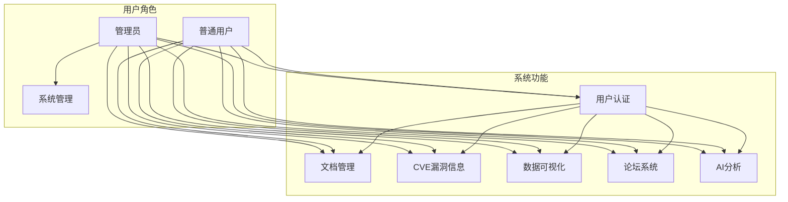
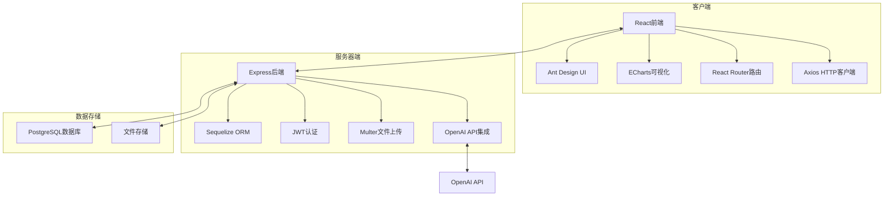

# APT攻击情报分析平台项目文档

## 1 项目介绍

### 1.1 项目背景

随着网络安全威胁的不断演变，APT（高级持续性威胁）攻击已成为企业和组织面临的主要安全挑战之一。APT攻击具有高度复杂性、针对性强、持续时间长等特点，传统的安全防御手段难以有效应对。

为了帮助安全分析人员更有效地分析和应对APT攻击，本项目旨在构建一个集成化的APT攻击情报分析平台，提供文档管理、CVE漏洞信息集成、AI智能分析和论坛交流等功能，为安全团队提供全面的情报分析工具。

项目基于现代化的技术栈，包括React前端、Node.js后端和PostgreSQL数据库，确保系统的高性能、可扩展性和安全性。

### 1.2 项目目标

1. **构建集成化情报分析平台**：整合文档管理、漏洞信息、数据分析和论坛交流功能，为安全分析人员提供一站式解决方案

2. **提供智能分析能力**：利用AI技术对APT攻击文档进行自动分析，识别攻击类型、评估威胁等级并生成防护建议

3. **实现数据可视化**：通过图表展示CVE漏洞分布、趋势和相关性，帮助分析人员快速理解安全态势

4. **促进安全知识共享**：通过论坛系统，促进安全专家之间的交流和知识共享

5. **确保系统安全性**：实现完善的用户认证和授权机制，保护敏感的安全情报

## 2 系统运行环境

### 2.1 网络环境要求

- **网络连接**：稳定的互联网连接，用于访问外部API（如OpenAI API）和更新CVE漏洞库
- **网络安全**：建议部署在安全的内部网络环境中，避免直接暴露在公网
- **带宽要求**：最低10Mbps带宽，支持文件上传和数据传输

### 2.2 软硬件环境要求

#### 2.2.1 服务器端

| 组件 | 版本/规格 | 用途 |
|------|-----------|------|
| Node.js | 20 LTS 或更高 | 运行后端服务 |
| PostgreSQL | 15 或更高 | 存储系统数据 |
| Express | 4.x | 后端Web框架 |
| Sequelize | 6.x | ORM数据库工具 |
| JWT | - | 用户认证 |
| Multer | - | 文件上传处理 |
| OpenAI API | - | AI分析功能 |

#### 2.2.2 客户端

| 组件 | 版本/规格 | 用途 |
|------|-----------|------|
| React | 18 | 前端框架 |
| Ant Design | 5 | UI组件库 |
| Tailwind CSS | 3 | 样式框架 |
| ECharts | 5 | 数据可视化 |
| React Router | 6 | 前端路由 |
| Axios | - | HTTP客户端 |

#### 2.2.3 硬件要求

| 设备 | 最低配置 | 推荐配置 |
|------|----------|----------|
| 服务器CPU | 4核 | 8核 |
| 服务器内存 | 8GB | 16GB |
| 存储空间 | 100GB | 200GB |
| 客户端浏览器 | Chrome 90+、Firefox 88+、Edge 90+ | 最新版本 |

## 3 系统功能

### 3.1 系统角色分析

| 角色 | 权限 | 功能访问 |
|------|------|----------|
| **普通用户** | 基础权限 | 浏览文档、查看CVE信息、参与论坛、个人资料管理 |
| **管理员** | 全部权限 | 普通用户所有功能 + 文档管理、用户管理、系统配置 |

### 3.2 系统主用例图

### 3.3 客户端子系统

#### 3.3.1 用户界面
- **登录/注册页面**：用户认证入口
- **首页**：系统概览、最新CVE和文档
- **文档管理**：文档列表、上传、查看、分析
- **CVE漏洞**：漏洞列表、详情、搜索
- **可视化**：数据分析图表
- **论坛**：帖子列表、发布、评论
- **个人中心**：用户资料管理
- **管理后台**：仅管理员可见，用户和系统管理

#### 3.3.2 功能模块

| 模块 | 功能描述 |
|------|----------|
| **用户认证** | 用户注册、登录、密码重置、个人资料管理 |
| **文档管理** | 文档上传、列表查看、详情展示、AI分析 |
| **CVE漏洞** | 漏洞列表、详情查看、搜索、热门排行 |
| **数据可视化** | 年份分布、漏洞类型、产品漏洞、POC可用性 |
| **论坛系统** | 帖子发布、评论、点赞、标签管理 |
| **AI分析** | 文档内容分析、威胁评估、防护建议 |

### 3.4 管理端/服务器端子系统

#### 3.4.1 后端服务
- **API服务**：提供RESTful API接口
- **认证服务**：JWT令牌生成和验证
- **数据库服务**：PostgreSQL数据存储和查询
- **文件服务**：文档上传和管理
- **AI服务**：与OpenAI API集成

#### 3.4.2 核心功能

| 模块 | 功能描述 |
|------|----------|
| **认证管理** | 用户注册、登录验证、令牌管理 |
| **文档管理** | 文档存储、检索、分析结果存储 |
| **CVE管理** | 漏洞数据同步、查询、分析 |
| **论坛管理** | 帖子和评论管理、内容审核 |
| **AI分析** | 文档分析、威胁评估、报告生成 |
| **系统管理** | 用户权限管理、系统配置 |

### 3.5 性能需求

| 指标 | 要求 |
|------|------|
| **响应时间** | 页面加载时间 < 2秒，API响应时间 < 500ms |
| **并发处理** | 支持1000+并发用户 |
| **数据处理** | 能够处理10万+ CVE记录，1万+文档 |
| **文件上传** | 支持最大100MB的文件上传 |
| **AI分析** | 文档分析响应时间 < 30秒 |

## 4 系统用例图及用例规约

### 4.1 系统用例图

```mermaid
flowchart TD
    subgraph 用户管理
        UC1[用户注册]
        UC2[用户登录]
        UC3[个人资料管理]
    end
    
    subgraph 文档管理
        UC4[上传文档]
        UC5[查看文档列表]
        UC6[查看文档详情]
        UC7[AI分析文档]
    end
    
    subgraph CVE管理
        UC8[查看CVE列表]
        UC9[搜索CVE]
        UC10[查看CVE详情]
        UC11[查看热门CVE]
    end
    
    subgraph 论坛系统
        UC12[发布帖子]
        UC13[查看帖子列表]
        UC14[查看帖子详情]
        UC15[发表评论]
        UC16[点赞帖子]
    end
    
    subgraph 数据可视化
        UC17[查看CVE分布图]
        UC18[查看漏洞类型分布]
        UC19[查看产品漏洞分布]
        UC20[查看POC可用性统计]
    end
    
    subgraph 系统管理
        UC21[用户管理]
        UC22[系统配置]
    end
    
    U[普通用户] --> UC1
    U --> UC2
    U --> UC3
    U --> UC4
    U --> UC5
    U --> UC6
    U --> UC7
    U --> UC8
    U --> UC9
    U --> UC10
    U --> UC11
    U --> UC12
    U --> UC13
    U --> UC14
    U --> UC15
    U --> UC16
    U --> UC17
    U --> UC18
    U --> UC19
    U --> UC20
    
    M[管理员] --> UC1
    M --> UC2
    M --> UC3
    M --> UC4
    M --> UC5
    M --> UC6
    M --> UC7
    M --> UC8
    M --> UC9
    M --> UC10
    M --> UC11
    M --> UC12
    M --> UC13
    M --> UC14
    M --> UC15
    M --> UC16
    M --> UC17
    M --> UC18
    M --> UC19
    M --> UC20
    M --> UC21
    M --> UC22
```

### 4.2 用例规约

#### 4.2.1 用户注册 (UC1)

| 项 | 内容 |
|----|------|
| **用例名称** | 用户注册 |
| **参与者** | 新用户 |
| **前置条件** | 用户未注册，访问注册页面 |
| **后置条件** | 注册成功后自动登录，跳转到首页 |
| **流程** | 1. 输入用户名、邮箱、密码 2. 点击注册按钮 3. 系统验证输入信息 4. 系统创建用户账号 5. 系统返回成功信息并登录 |
| **异常** | 用户名已存在、邮箱格式错误、密码强度不足 |

#### 4.2.2 用户登录 (UC2)

| 项 | 内容 |
|----|------|
| **用例名称** | 用户登录 |
| **参与者** | 已注册用户 |
| **前置条件** | 用户已注册，访问登录页面 |
| **后置条件** | 登录成功后跳转到首页，系统生成JWT令牌 |
| **流程** | 1. 输入邮箱/用户名和密码 2. 点击登录按钮 3. 系统验证凭证 4. 系统生成JWT令牌 5. 系统返回成功信息并跳转到首页 |
| **异常** | 用户名或密码错误、账号被锁定 |

#### 4.2.3 上传文档 (UC4)

| 项 | 内容 |
|----|------|
| **用例名称** | 上传文档 |
| **参与者** | 已登录用户 |
| **前置条件** | 用户已登录，访问文档管理页面 |
| **后置条件** | 文档上传成功，显示在文档列表中 |
| **流程** | 1. 点击上传按钮 2. 选择文件（PDF、Word、TXT等） 3. 输入文档标题和描述 4. 点击确认上传 5. 系统处理文件并存储 6. 系统返回成功信息 |
| **异常** | 文件格式不支持、文件大小超过限制、上传失败 |

#### 4.2.4 AI分析文档 (UC7)

| 项 | 内容 |
|----|------|
| **用例名称** | AI分析文档 |
| **参与者** | 已登录用户 |
| **前置条件** | 用户已登录，文档已上传 |
| **后置条件** | 分析完成后显示分析结果 |
| **流程** | 1. 在文档列表中选择文档 2. 点击分析按钮 3. 系统提交文档内容到AI服务 4. AI服务分析文档内容 5. 系统显示分析结果（威胁等级、攻击类型、防护建议） |
| **异常** | 分析超时、AI服务不可用 |

#### 4.2.5 查看CVE列表 (UC8)

| 项 | 内容 |
|----|------|
| **用例名称** | 查看CVE列表 |
| **参与者** | 已登录用户 |
| **前置条件** | 用户已登录，访问CVE页面 |
| **后置条件** | 显示CVE漏洞列表 |
| **流程** | 1. 访问CVE页面 2. 系统加载CVE列表 3. 用户可以分页浏览或筛选 |
| **异常** | 数据加载失败 |

#### 4.2.6 发布帖子 (UC12)

| 项 | 内容 |
|----|------|
| **用例名称** | 发布帖子 |
| **参与者** | 已登录用户 |
| **前置条件** | 用户已登录，访问论坛页面 |
| **后置条件** | 帖子发布成功，显示在帖子列表中 |
| **流程** | 1. 点击发布按钮 2. 输入标题和内容 3. 添加标签 4. 点击发布 5. 系统存储帖子并返回成功信息 |
| **异常** | 内容为空、标题过短 |

#### 4.2.7 查看数据可视化 (UC17-UC20)

| 项 | 内容 |
|----|------|
| **用例名称** | 查看数据可视化 |
| **参与者** | 已登录用户 |
| **前置条件** | 用户已登录，访问可视化页面 |
| **后置条件** | 显示各种数据图表 |
| **流程** | 1. 访问可视化页面 2. 系统加载CVE分析数据 3. 系统生成并显示各种图表 |
| **异常** | 数据加载失败、图表渲染错误 |

#### 4.2.8 用户管理 (UC21)

| 项 | 内容 |
|----|------|
| **用例名称** | 用户管理 |
| **参与者** | 管理员 |
| **前置条件** | 管理员已登录，访问管理后台 |
| **后置条件** | 用户信息更新或用户被管理 |
| **流程** | 1. 访问用户管理页面 2. 查看用户列表 3. 编辑用户信息或权限 4. 系统更新用户数据 |
| **异常** | 操作失败、权限不足 |

## 5 系统架构

### 5.1 技术架构

### 5.2 数据流

1. **用户认证流程**：用户登录 → 后端验证 → 生成JWT令牌 → 前端存储令牌 → 后续请求携带令牌

2. **文档管理流程**：用户上传文档 → 后端存储文件 → 数据库记录文档信息 → 前端显示文档列表

3. **AI分析流程**：用户请求分析 → 后端读取文档内容 → 调用OpenAI API → 分析结果存储 → 前端显示分析结果

4. **CVE数据流程**：后端同步CVE数据 → 存储到数据库 → 前端查询和展示

5. **论坛流程**：用户发布帖子 → 后端存储帖子 → 前端显示帖子列表 → 用户评论和点赞

## 6 部署与维护

### 6.1 部署方式

1. **Docker Compose部署**（推荐）：
   - 使用docker-compose.yml文件编排容器
   - 包含前端、后端和PostgreSQL数据库
   - 一键启动整个系统

2. **本地开发部署**：
   - 分别启动前端和后端服务
   - 配置本地PostgreSQL数据库

### 6.2 维护与监控

1. **日志管理**：系统生成详细的操作和错误日志
2. **性能监控**：监控API响应时间和系统资源使用
3. **安全更新**：定期更新依赖包和安全补丁
4. **数据备份**：定期备份数据库和重要文件

## 7 总结

APT攻击情报分析平台是一个综合性的安全分析工具，通过整合文档管理、CVE漏洞信息、AI分析和论坛交流功能，为安全分析人员提供了一个强大的情报分析平台。系统采用现代化的技术栈，具有良好的可扩展性和安全性。

本项目的实施将有助于提高安全团队对APT攻击的分析能力，缩短威胁识别和响应时间，为组织的网络安全提供更有力的保障。